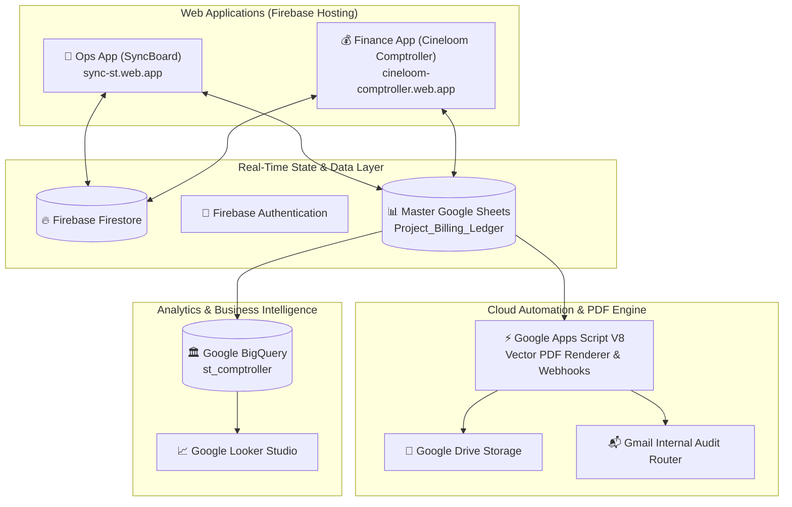

# sync-st — Studio Operations & Financial Comptroller Platform

**Platform:** `sync-st` | `cineloom-comptroller`  
**Organization:** Cineloom Postworks Pvt. Ltd. / Studio Tunnel  
**Lead / Studio Owner:** Samiran Sonowal ([samiran@studiotunnel.com](mailto:samiran@studiotunnel.com) / GitHub: [@samiransonowal](https://github.com/samiransonowal))  
**GCP Administration Account:** `lab@studiotunnel.com`  
**GCP Project ID:** `sync-st` (Project Number: `972643538415`)  
**GitHub Repository:** [github.com/samiransonowal/sync-st](https://github.com/samiransonowal/sync-st)  
**Live Web Applications:**
- 🏢 **Operations App (SyncBoard):** [https://sync-st.web.app](https://sync-st.web.app)
- 💰 **Finance App (Cineloom Comptroller):** [https://cineloom-comptroller.web.app](https://cineloom-comptroller.web.app)

---

> [!CAUTION]
> ### 🛑 MANDATORY OUTBOUND EMAIL SAFETY RULE
> **THIS AUTOMATION WILL NEVER SEND EMAILS DIRECTLY TO EXTERNAL CLIENTS UNDER ANY CIRCUMSTANCES.**  
> All generated invoices, draft previews, and email dispatches are strictly locked and routed exclusively to authorized internal Studio Tunnel addresses:
> - `finance@studiotunnel.com`
> - `samiran@studiotunnel.com`
> - `contact@studiotunnel.com`
> - `tamash@studiotunnel.com`

> [!IMPORTANT]
> ### 🛡️ 3-TIER CLOUD-NATIVE ARCHITECTURE
> - **100% Native on Google Cloud & Google Workspace:** Workflows, event triggers, and business logic run strictly within GCP, Firebase, and Google Workspace.
> - **Zero Python Dependency in Production:** Production runtimes run on Node.js / TypeScript (Vite/React) and Google Apps Script (JavaScript V8).
> - **Multi-Tier Branch Strategy:**
>   - `dev` (Default Development Branch) &rarr; Staging Sheets & `st_comptroller_dev`
>   - `test` (Automated Staging & Testing) &rarr; Test Sheets & `st_comptroller_test`
>   - `pml` / `main` (Production Master Live) &rarr; Official Sheets & `st_comptroller_pml`

---

## 🎯 Purpose & Overview

**`sync-st`** (powered by **Cineloom Comptroller**) is the unified operations and financial management platform for **Studio Tunnel** / **Cineloom Postworks Pvt. Ltd.** 

It replaces fragmented spreadsheets and disjointed tools with a modern, real-time reactive architecture:
1. **Real-time Project & Operations Tracking:** Live project boards, studio booking schedules, client CRM directories, and operational checklists.
2. **Automated Financial Comptroller:** Vector HTML & PDF invoice generation, GST tax modeling (CGST, SGST, IGST), TDS/withholding tracking, and Google Drive archival.
3. **Data Warehouse & Audit Ledger:** High-performance BigQuery analytics connected to Google Looker Studio for executive overview and overdue payment chasing.
4. **Instant Team Communication:** Automated WhatsApp templates, Discord/Ntfy push notifications, and team collaboration feeds.

---

## 🏗️ Applications & Core Tools



---

### 1. 🏢 Operations App (`apps/ops-app`)
A modern, responsive React 19 + Vite web application deployed on Firebase Hosting:
* **Project Tracker:** Real-time visibility into project statuses (`Quoted`, `In Progress`, `Delivered`, `Invoiced`, `Paid`).
* **Studio Bookings & Calendar:** Suite booking management for color grading, conform, and mastering suites.
* **Client CRM:** Central directory of production houses, agency contacts, and billing profiles.
* **Communication & Templates:** Quick-action WhatsApp dispatch templates, Discord notifications, and Ntfy push alerts.
* **Team Utilities:** Interactive SOP Guides, IT Support Ticketing, Team Notepad, and Recycle Bin recovery.

### 2. 💰 Finance App — Cineloom Comptroller (`apps/finance-app`)
A specialized billing and accounting interface:
* **Vector Invoice Generator:** Generates pixel-perfect, GST-compliant vector invoices.
* **Multi-Currency & Tax Engine:** Auto-calculates CGST/SGST (intra-state) vs. IGST (inter-state), reverse charges, and PAN/GSTIN validation.
* **Ledger Synchronization:** Bi-directional sync with master Google Sheets (`Project_Billing_Ledger`).
* **Google Drive Document Vault:** Directly stores generated invoices in structured Drive folders (`ST-Invoices/FY26-27`).

### 3. ⚡ Google Apps Script Automation Engine (`engine/google-apps-script`)
* **`3_PdfAndEmailer.gs`:** Renders vector HTML templates to high-resolution PDF documents.
* **`5_ScheduledBotsAndReminders.gs`:** Cron triggers for overdue payment reminders and booking alerts.
* **`operations-app/TrackerWebApp.gs`:** REST webhook endpoints connecting frontend actions to Google Sheets.
* **`DesignSystem.gs`:** Standardized visual tokens, typography (Lexend), and contrast ratios.

### 4. 🏛️ Google BigQuery & Looker Studio
* **Dataset:** `sync-st.st_comptroller`
* **Features:** Partitioned event logs, automated SQL views, historical payment velocity analysis, and Looker Studio executive financial dashboards.

---

## 📁 Repository Structure

```text
SYNC_ST/
├── .github/workflows/gas-ci.yml        <-- Automated CI/CD Pipeline (dev/test/pml)
├── .gitignore                          <-- Multi-layer security ignore rules
├── firebase.json                       <-- Firebase Hosting, Firestore & Storage targets
├── firestore.rules                     <-- Firestore security rules
├── storage.rules                       <-- Cloud Storage security rules
├── package.json                        <-- Deployment scripts & dependencies
│
├── apps/
│   ├── ops-app/                        <-- React 19 + Vite Operations Web App (sync-st)
│   │   ├── src/components/             <-- ProjectTracker, Bookings, CRM, SOPs, Chat
│   │   ├── src/services/               <-- Firebase, Discord, Ntfy integrations
│   │   └── package.json                <-- Frontend dependencies (Tailwind, Lucide, Firebase)
│   └── finance-app/                    <-- Financial Comptroller & Invoicing UI
│       └── public/                     <-- Web app frontend assets (cineloom-comptroller)
│
├── engine/
│   └── google-apps-script/             <-- Core Google Apps Script automation
│       ├── 3_PdfAndEmailer.gs          <-- Vector PDF generator & internal email dispatcher
│       ├── 5_ScheduledBotsAndReminders.gs <-- Automated cron bots and reminder triggers
│       ├── DesignSystem.gs             <-- Corporate branding & styling tokens
│       └── operations-app/             <-- Apps Script web app endpoint handlers
│
├── documentation/                      <-- Complete Architectural Documentation & SOPs
│   ├── SYSTEM_ARCHITECTURE_AND_OPERATIONS_MANUAL.md <-- Master SOP & Ops Manual
│   ├── organization/users.yaml         <-- Verified organization directory & roles
│   ├── master-specs/                   <-- Specifications & workflow designs
│   └── tech-stack/                     <-- Technical deep-dives (01 to 08)
│
├── credentials/
│   ├── public/                         <-- Public metadata & credentials.env.example
│   └── private/                        <-- [GIT-IGNORED] Local service accounts & secrets
│
└── sample-documents/                   <-- [GIT-IGNORED] Local confidential files & statements
    └── bank statements/                <-- Private bank statements (Protected by 4-layer security)
```

---

## 🚀 Deployment & Development Commands

### 💻 Local Development
```bash
# Install root dependencies
npm install

# Run Operations App locally
cd apps/ops-app
npm install
npm run dev

# Build Operations App for production
npm run build
```

### 🚢 Firebase Hosting Deployments
```bash
# Deploy Operations App to https://sync-st.web.app
npm run deploy:ops

# Deploy Finance App to https://cineloom-comptroller.web.app
npm run deploy:finance

# Deploy all apps simultaneously
npm run deploy:all
```

### ☁️ Google Apps Script (Clasp)
```bash
# Deploy Apps Script engine via Clasp
npm run clasp-push
```

---

## 🔐 Security & Confidentiality Safeguards

1. **4-Layer Bank Statement & Secret Defense:**
   - Multi-pattern rules in `.gitignore` and `.git/info/exclude`.
   - Local `.git/hooks/pre-commit` and `.git/hooks/pre-push` that abort any commit/push containing confidential financial records or private keys.
2. **Strict Internal Routing:** Outbound email dispatches are hard-locked to verified `@studiotunnel.com` addresses.
3. **Branch Protection:** Code promotion from `dev` &rarr; `test` &rarr; `pml` is strictly governed.

---

## 📄 License & Governance

Copyright &copy; 2026 **Cineloom Postworks Pvt. Ltd. / Studio Tunnel**. All rights reserved.  
Confidential & Proprietary.
