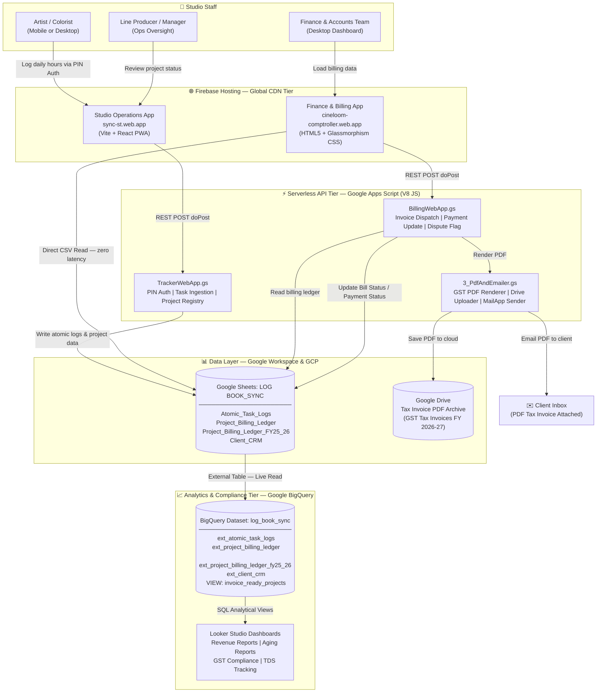
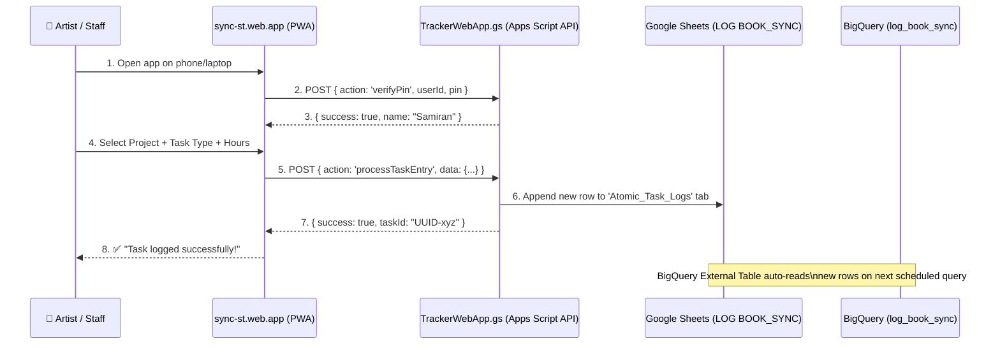
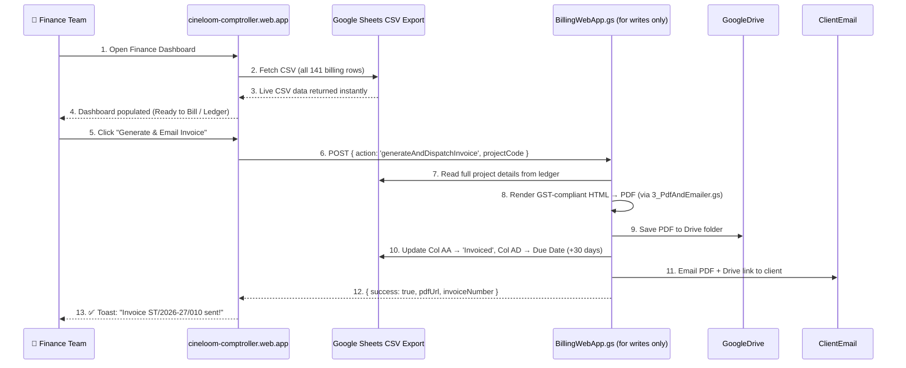
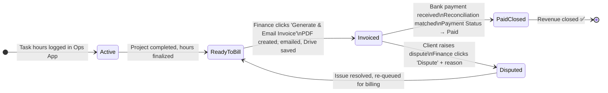
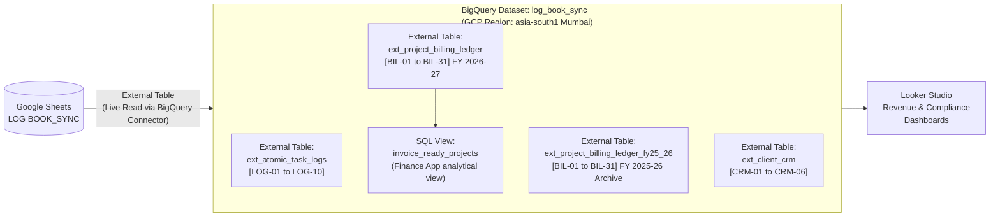

# 🛠 Studio Tunnel — System Architecture & Stakeholder Operations Manual

> **Document Version**: v2.0.0 (Production Master Live)  
> **Prepared by**: Engineering & Operations Team, Studio Tunnel  
> **Target Audience**: Stakeholders, Executive Management, Line Producers, Finance & Accounts Team, Engineering Staff  
> **Classification**: Internal — Not for External Distribution  
> **Live Systems**:  
> - **Studio Operations App** → [https://sync-st.web.app](https://sync-st.web.app)  
> - **Finance & Billing App** → [https://cineloom-comptroller.web.app](https://cineloom-comptroller.web.app)  
> - **Master Database Sheet (`LOG BOOK_SYNC`)** → [Google Sheet](https://docs.google.com/spreadsheets/d/1YEvUPQ_ZKJyUUPM2Ib-7ZnrliZoOs5Byhf9Ga8Uzkpg/edit)  
> - **Data Warehouse (BigQuery)** → GCP Project `st-in-gen`, Dataset `log_book_sync`, Region `asia-south1` (Mumbai)  
> - **Reporting** → Google Looker Studio (connected to BigQuery)

---

## 📋 1. Executive Summary

The **Studio Tunnel Platform** is a dual-application, cloud-native ecosystem engineered for post-production workflow automation, atomic task tracking, billing ledger management, automated GST invoice generation, and full financial analytics. The platform was built from the ground up on **100% Google Cloud Platform** — no external servers, no vendor lock-in, no recurring hosting bills.

**What it replaces**: Manual Excel tracking, WhatsApp billing updates, disconnected accounting software, and paper chase-lists. 

**What it delivers**: A fully automated trail from the moment an artist begins work, to client invoice dispatch, to payment reconciliation — all in one synchronized platform.

---

## 🏗 2. System Architecture

### 2.1 High-Level Architecture Diagram



---

### 2.2 Technology Stack Reference

| Layer | Technology | Cost | Role in Platform |
| :--- | :--- | :---: | :--- |
| **Frontend Hosting** | Firebase Hosting (GCP CDN) | ₹0 | Serves both web apps globally with SSL, zero-downtime |
| **Operations Frontend** | Vite + React (PWA) | ₹0 | Mobile-first app for daily task logging |
| **Finance Frontend** | HTML5 + Vanilla CSS | ₹0 | Full-featured financial dashboard |
| **Primary Database** | Google Sheets (LOG BOOK_SYNC) | ₹0 | Operational live data store |
| **Serverless APIs** | Google Apps Script (V8 JS) | ₹0 | REST microservices for writes, PDF, email |
| **Data Warehouse** | Google BigQuery (`log_book_sync`) | ₹0* | Analytics, compliance, reporting |
| **BI & Reporting** | Google Looker Studio | ₹0 | Management dashboards, GST/TDS reports |
| **PDF Storage** | Google Drive API | ₹0 | Tax invoice archive |
| **Email Dispatch** | Google Workspace MailApp | ₹0 | Automated invoice emails to clients |

> *BigQuery free tier: 10 GB storage + 1 TB query processing per month. Well within current studio usage.

---

## ⚙️ 3. The Two Web Applications — Detailed Breakdown

---

### App 1: Studio Operations App (`sync-st.web.app`)

**Purpose**: The day-to-day operational command centre for Studio Tunnel. Every hour worked by every artist and producer is logged here in real time.

#### 3.1.1 Feature Modules

| Module | What It Does |
| :--- | :--- |
| **PIN Authentication** | Staff log in with their unique 4-digit PIN. No passwords to remember, works on any device instantly. |
| **Project Registry** | Browse all active and past projects. View project codes, client names, and current status at a glance. |
| **Atomic Task Logger** | Log individual work sessions: select project, task type, assigned artist, date, hours, and scope notes. |
| **Day Log Summary** | See all tasks logged for the current day across all artists. |
| **Submission Tracker** | Record deliverable handoffs (graded files, DCP exports, etc.) to clients. |

#### 3.1.2 How Data Flows (Operations)



#### 3.1.3 Atomic Task Log Schema (`Atomic_Task_Logs` Tab)

| Column | Code | Field | Values |
| :---: | :---: | :--- | :--- |
| A | `[LOG-01]` | Task ID (UUID) | Auto-generated unique ID |
| B | `[LOG-02]` | Timestamp | Auto-captured submission time |
| C | `[LOG-03]` | Project Code ID | e.g. `1144_MIS_SS` |
| D | `[LOG-04]` | Project Name | e.g. `Cadbury Silk Campaign` |
| E | `[LOG-05]` | Task Type | `Booking`, `Conform`, `Assist`, `Mastering`, `Rendering` |
| F | `[LOG-06]` | Assigned Artist / Staff | e.g. `Sujith Vijayan` |
| G | `[LOG-07]` | Task Date | Date of session |
| H | `[LOG-08]` | Actual Hours | e.g. `4.5` |
| I | `[LOG-09]` | Task Closure Status | `Logged` / `Closed & Completed` |
| J | `[LOG-10]` | Notes / Scope | Session notes, revision details |

---

### App 2: Finance & Billing App (`cineloom-comptroller.web.app`)

**Purpose**: A real-time financial command centre for the Accounts Team. Manage the entire billing lifecycle — from reviewing unbilled work to dispatching GST Tax Invoices and tracking every rupee owed.

#### 3.2.1 Dashboard KPI Cards

The top row of the dashboard shows four live key performance indicators, calculated directly from `Project_Billing_Ledger`:

| KPI Card | What It Shows | Source Logic |
| :--- | :--- | :--- |
| **Ready to Bill** | Count of projects pending invoice dispatch | `Bill Status` ≠ `Invoiced` AND ≠ `Disputed` |
| **Total Invoiced** | Count and total GST amount of invoices sent | `Bill Status` = `Invoiced` |
| **Pending Receivables** | Total outstanding receivable amount | `Invoiced` + `Payment Status` ≠ `Paid` |
| **Total Collected** | Total amount where payment confirmed | `Payment Status` = `Paid` |

#### 3.2.2 How Data Flows (Finance — Reading)

The Finance App uses a **high-speed direct CSV read** from Google Sheets — not the Apps Script API — to load the billing ledger. This design ensures the dashboard always shows live data with **zero caching issues**.

```
https://docs.google.com/spreadsheets/d/1YEvUPQ_ZKJyUUPM2Ib-7ZnrliZoOs5Byhf9Ga8Uzkpg/gviz/tq?tqx=out:csv&sheet=Project_Billing_Ledger
```



---

## 💼 4. The Billing Lifecycle — Full State Machine

Every project in `Project_Billing_Ledger` passes through a well-defined lifecycle controlled by two key columns:
- **Column AA** — `Bill Status`: `Active / In Progress` → `Invoiced` → `Disputed`
- **Column AB** — `Payment Status`: `Unpaid` → `Partially Paid` → `Paid`



---

## 📊 5. Google BigQuery — Data Warehouse & Analytics Tier

### 5.1 What BigQuery Does in This Platform

Google BigQuery is the **read-only analytical layer** of the Studio Tunnel platform. It never receives direct writes from the web apps. Instead, it reads live data directly from `LOG BOOK_SYNC` using **External Tables** (Google Sheets → BigQuery native connector).

**BigQuery is used for**:
- 📊 **Management Reporting**: Monthly revenue summaries, year-over-year comparisons
- 🧾 **GST Compliance**: Tax-ready reports for quarterly GSTR-1 and TDS (26AS) reconciliation
- 💰 **Receivable Aging**: Days overdue analysis, client-level payment history
- 📉 **Artist Productivity**: Hours per project, hours per artist, utilization rates
- 🔍 **Audit Trail**: Immutable historical records of all transactions

### 5.2 BigQuery Data Architecture



### 5.3 BigQuery External Tables — What They Map To

| BigQuery Table | Source Sheet Tab | Rows Covered | Business Purpose |
| :--- | :--- | :---: | :--- |
| `ext_atomic_task_logs` | `Atomic_Task_Logs` | Growing daily | Track all billable hours by artist/project |
| `ext_project_billing_ledger` | `Project_Billing_Ledger` | FY 2026-27 | Live billing pipeline and receivables |
| `ext_project_billing_ledger_fy25_26` | `Project_Billing_Ledger_FY25_26` | FY 2025-26 | Historical archive for audit & comparison |
| `ext_client_crm` | `Client_CRM` | All clients | Client master data for GST compliance |

### 5.4 Example Analytical Queries (for Management Reporting)

**Revenue by Client (Current FY)**:
```sql
SELECT client_name, COUNT(*) AS invoices, SUM(gst_bill_amount) AS total_billed, SUM(tds_deduction) AS total_tds
FROM `log_book_sync.ext_project_billing_ledger`
WHERE bill_status = 'Invoiced'
GROUP BY client_name ORDER BY total_billed DESC;
```

**Overdue Receivables (Aging > 30 Days)**:
```sql
SELECT project_code_id, client_name, gst_bill_amount, due_date,
       DATE_DIFF(CURRENT_DATE(), due_date, DAY) AS days_overdue
FROM `log_book_sync.ext_project_billing_ledger`
WHERE payment_status = 'Unpaid' AND due_date < CURRENT_DATE()
ORDER BY days_overdue DESC;
```

**Hours by Artist (Productivity Report)**:
```sql
SELECT assigned_artist, SUM(actual_hrs) AS total_hours, COUNT(*) AS sessions
FROM `log_book_sync.ext_atomic_task_logs`
GROUP BY assigned_artist ORDER BY total_hours DESC;
```

---

## 🗓 6. Standard Operating Procedures (SOPs) — Step by Step

---

### SOP-001: Daily Task Logging (Artists & Studio Staff)

**Responsible**: All studio artists, colorists, and production staff  
**Frequency**: Daily, at end of each work session  
**App**: [sync-st.web.app](https://sync-st.web.app)

#### Steps:

**Step 1 — Open the App**  
Open [sync-st.web.app](https://sync-st.web.app) on your mobile phone or laptop. No installation needed; it works in any browser.

**Step 2 — Enter PIN**  
Type your assigned 4-digit PIN and tap **Login**. If you do not have a PIN, request one from the Line Producer.

**Step 3 — Select Your Project**  
From the project list, select the **Project Code** for the session you completed (e.g. `1144_MIS_SS`). If you cannot find it, the Line Producer must add it first.

**Step 4 — Fill Task Details**
- **Task Type**: Choose the type of work (e.g. `Booking` = color grading session, `Conform` = XML/EDL conform, `Mastering` = HDR/DCP export, `Assist` = setup/prep, `Rendering` = overnight render).
- **Duration (Hours)**: Enter the number of hours worked. Decimals are fine (e.g. `4.5` for 4 hours 30 minutes).
- **Notes**: Briefly describe the scope (e.g. `"Online conform + 3 revision rounds, final DCP delivered"`).

**Step 5 — Submit**  
Tap **Submit Task**. A green confirmation message will appear. The entry is now live in the master Google Sheet.

> ⚠️ **Important Rules**:
> - Log tasks on the **same day** they are performed. Do not batch-log multiple days.
> - Do NOT manually edit the Google Sheet directly. All entries must go through the app.
> - If you made an error, inform the Line Producer to correct it in the sheet.

---

### SOP-002: Adding a New Project (Line Producer / Studio Manager)

**Responsible**: Line Producer or Studio Manager  
**When**: Every time a new commercial, film, or project begins  
**App**: [sync-st.web.app](https://sync-st.web.app)

#### Steps:

**Step 1** — Log in to the Operations App with your Manager PIN.

**Step 2** — Navigate to the **Add Project** section.

**Step 3** — Fill in the following fields:
- **Project Code**: Use the studio naming convention — `[Invoice#]_[ClientCode]_[Type]` (e.g. `1144_MIS_SS`).
- **Project Name**: The title of the ad, film, or series.
- **Client / Company**: Legal client name exactly as it appears on PO or contract.
- **Colorist / Director**: Assign the lead artist.
- **Rate**: The agreed rate (default ₹5,000/hr; override if negotiated differently).

**Step 4** — Submit. The project is now available for artists to log tasks against it.

**Step 5** — Simultaneously, add the project's billing row in the `Project_Billing_Ledger` sheet with all client details (GSTIN, PAN, billing address, client email) filled in. This is critical for invoice generation.

---

### SOP-003: Generating & Dispatching a GST Tax Invoice (Finance Team)

**Responsible**: Finance & Accounts Team  
**When**: When a project has been completed and approved for billing by the Line Producer  
**App**: [cineloom-comptroller.web.app](https://cineloom-comptroller.web.app)

#### Steps:

**Step 1 — Open Finance Dashboard**  
Open [cineloom-comptroller.web.app](https://cineloom-comptroller.web.app). Data loads automatically (no login required — app is restricted to internal network by design).

**Step 2 — Check the Ready to Bill Tab**  
The **Ready to Bill** tab shows all projects where `Bill Status` is not yet `Invoiced`. This is your invoice queue.

**Step 3 — Verify Project Details**  
Before generating an invoice, confirm the following directly in the Google Sheet (`Project_Billing_Ledger`):
- ✅ Column E: Client / Company name (must match PO / legal entity)
- ✅ Column O: Rate per hour
- ✅ Column Q: Subtotal Amount is correct
- ✅ Column R: GST Total (18%) is correct
- ✅ Column T: Client email is valid and correct
- ✅ Column V: Client GSTIN is entered
- ✅ Column Z: PO Number is filled (if client has one)

> ⚠️ **Do not proceed if the client email (Col T) or GSTIN (Col V) is missing.** The invoice will generate but the email may go to a wrong address.

**Step 4 — Click "Generate & Email Invoice"**  
Click the button next to the project. The system will:
1. Generate a fully formatted GST Tax Invoice PDF (with Studio Tunnel letterhead, authorized signature, bank details, HSN code `999612`).
2. Save the PDF permanently to Google Drive.
3. Send an email to the client with the PDF attached and a Drive download link.
4. Update the project's `Bill Status` to `Invoiced` in the sheet.
5. Set the `Due Date` to **30 days from today** automatically.

**Step 5 — Confirm Dispatch**  
A green toast notification confirms the invoice was sent. The project disappears from the **Ready to Bill** tab and appears in the **Accounts Receivable Ledger**.

---

### SOP-004: Updating Payment Status (Finance Team)

**Responsible**: Finance & Accounts Team  
**When**: Upon receiving bank payment or TDS certificate from client  
**App**: [cineloom-comptroller.web.app](https://cineloom-comptroller.web.app)

#### Steps:

**Step 1** — Go to the **Accounts Receivable Ledger** tab.

**Step 2** — Locate the project that received payment. Confirm in HDFC bank statement that payment matches the invoice amount (after TDS deduction, if applicable).

**Step 3** — Click the **Update Payment** button next to the project.

**Step 4** — Fill in:
- **Payment Status**: `Paid` / `Partially Paid`
- **Amount Pending**: Remaining unpaid balance in INR (after payment received)
- **TDS Amount**: Enter the TDS deducted (typically 10% of subtotal under Section 194J)

**Step 5** — Submit. The sheet is updated in real time. BigQuery reflects the payment status on its next scheduled query.

---

### SOP-005: Flagging a Disputed Invoice (Finance Team)

**Responsible**: Finance & Accounts Team  
**When**: A client disputes the invoice amount, scope, or hours  

#### Steps:

**Step 1** — In the **Accounts Receivable Ledger**, locate the disputed project.

**Step 2** — Click the **Dispute** button.

**Step 3** — Enter the reason for dispute in the modal (e.g. `"Client disputes session hours — requesting breakdown from Ops"`).

**Step 4** — Submit. The system:
- Sets `Bill Status` to `Disputed`.
- Appends the dispute reason to Column Y (Notes).
- Removes the project from both invoice queues.

**Step 5** — Escalate to the Line Producer to verify hours in the Atomic Task Logs and resolve with the client. Once resolved, the `Bill Status` is manually reset to `Active / In Progress` to re-enter the Ready to Bill queue.

---

## 🔒 7. Security, Governance & Data Integrity Rules

### 7.1 Access Control
- Both web apps are publicly accessible via URL but bound to authorized **Google Workspace (`@studiotunnel.com`) accounts** for all backend write operations.
- The `LOG BOOK_SYNC` Google Sheet is shared only with authorized studio members. Client-facing data (email, GSTIN, PAN) must not be shared externally.

### 7.2 Data Integrity — Critical Rules
1. **Never delete or rename column headers** in the Google Sheet. All scripts and BigQuery external tables reference columns by **0-based index position** (`Col A = index 0`). Renaming or deleting a header will silently break data mapping.
2. **Never insert columns in the middle** of either the `Atomic_Task_Logs` or `Project_Billing_Ledger` tabs. New columns must only be appended at the end.
3. **Never manually change `Bill Status`** to `Invoiced` unless an actual invoice has been generated and dispatched through the app. Manual changes bypass the automated PDF/email/ledger update pipeline.
4. **All task logs must be submitted via the app**, not directly typed into the Google Sheet. Direct sheet edits will bypass UUID assignment and timestamp logging.

### 7.3 Environment Tiers

| Tier | Branch | Google Sheet | BigQuery Dataset | Purpose |
| :--- | :---: | :--- | :--- | :--- |
| **DEV** | `dev` | Dev Sheet (sandbox) | `st_comptroller_dev` | Engineering development & testing |
| **TEST** | `test` | Test Sheet | `st_comptroller_test` | QA & user acceptance testing |
| **PML (Production)** | `main` | `LOG BOOK_SYNC` (live) | `log_book_sync` | Live studio operations |

> ⚠️ **Never run test scripts against the PML (Production) sheet** without a `--confirm-pml` flag and senior approval. A wrong write to production data requires a manual correction.

### 7.4 Secret & Credential Protection
- All API keys, OAuth credentials, Firebase service account keys, and private financial documents are stored in `credentials/private/` which is **excluded from Git** via `.gitignore`.
- Bank statements and Vyapar export files must never be committed to the GitHub repository.
- The `sample-documents/` directory is permanently excluded from version control.

---

## 📞 8. Escalation & Support Contacts

| Issue | First Point of Contact | Escalation |
| :--- | :--- | :--- |
| Cannot log in (PIN not working) | Line Producer | Studio Management |
| Project code not found in app | Line Producer (add project first) | Studio Management |
| Invoice email not received by client | Finance Team (check Col T email) | Engineering |
| Dashboard not loading data | Engineering | Verify Google Sheet sharing permissions |
| Incorrect hours on a submitted log | Line Producer (correct in sheet) | Engineering if UUID mismatch |
| BigQuery data not updating | Engineering | Check External Table connection in BigQuery Console |

---

*This document was last updated: 26 August 2026 | Studio Tunnel Engineering & Operations Team*
