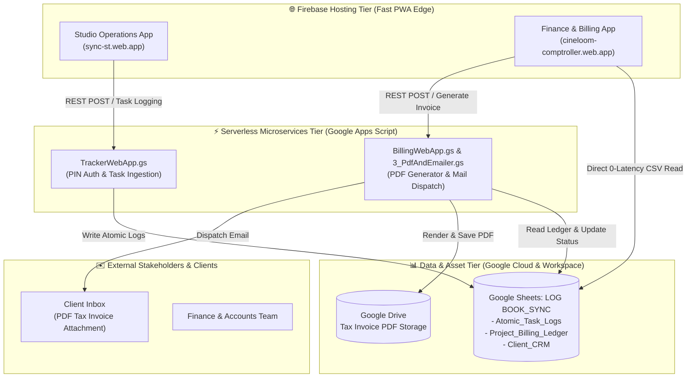
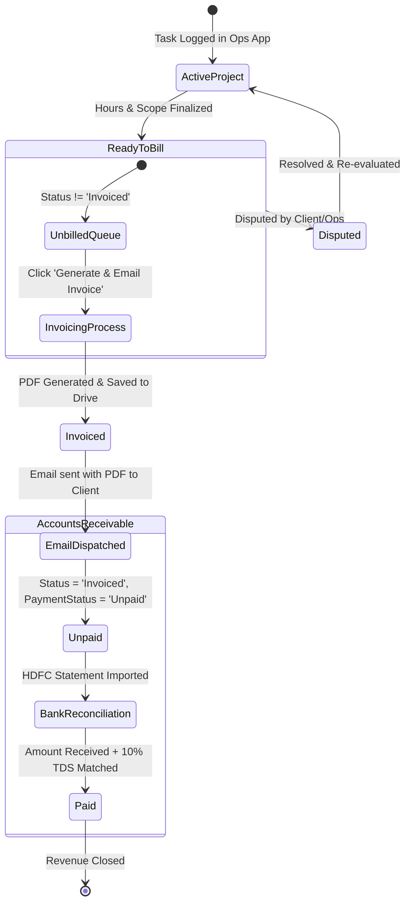

# 🛠 Studio Tunnel — System Architecture & Stakeholder Operations Manual

> **Document Version**: v1.0.0 (Production Master Live)  
> **Target Audience**: Stakeholders, Executive Management, Line Producers, Finance & Accounts Team, Engineering Staff  
> **Live Systems**:  
> - **Studio Operations App**: [https://sync-st.web.app](https://sync-st.web.app)  
> - **Finance & Billing App**: [https://cineloom-comptroller.web.app](https://cineloom-comptroller.web.app)  
> - **Master Database Sheet (`LOG BOOK_SYNC`)**: [Google Sheet Link](https://docs.google.com/spreadsheets/d/1YEvUPQ_ZKJyUUPM2Ib-7ZnrliZoOs5Byhf9Ga8Uzkpg/edit)

---

## 📋 Executive Summary

The **Studio Tunnel Platform** is a dual-application, cloud-native ecosystem engineered specifically for post-production workflow automation, atomic task tracking, billing ledger management, and automated GST invoice generation. 

By unifying day-to-day studio task logs with financial accounting in real-time, the platform eliminates manual data entry, prevents revenue leakage, automates client invoice emails, and provides full transparency for studio management.

---

## 🏛 1. Cloud-Native Infrastructure & Technology Stack

The entire system operates strictly within **Google Cloud Platform (GCP)** and **Google Workspace**, following zero-developer-workstation dependencies.

| Layer | Technology | Purpose & Responsibility |
| :--- | :--- | :--- |
| **Frontend Hosting** | **Firebase Hosting (GCP)** | Global CDN hosting for both PWA web applications with zero downtime. |
| **Operations Frontend** | **Vite + React PWA** | Mobile-responsive PWA for artists and producers to log hourly work. |
| **Finance Frontend** | **Vanilla HTML5 + Glassmorphism CSS** | Premium financial dashboard for invoice tracking and queue management. |
| **Database & Warehouse** | **Google Sheets (`LOG BOOK_SYNC`)** | Primary cloud database containing `Atomic_Task_Logs` & `Project_Billing_Ledger`. |
| **Serverless Microservices** | **Google Apps Script (V8 JS)** | Backend API handlers (`doPost`), PDF rendering, and MailApp dispatch. |
| **Document Storage** | **Google Drive API** | Secure cloud archive for generated PDF Tax Invoices. |
| **Reconciliation Scripts** | **Python 3.12 (Local/Cloud)** | Automated HDFC bank statement reconciliation and TDS matching engines. |

---

## ⚙️ 2. Core Modules & Operating Logic

### Module A: Studio Operations App (`sync-st.web.app`)

**Purpose**: Allows staff, colorists, and line producers to log atomic post-production tasks in real-time.

1. **PIN Authentication**: Staff members authenticate using secure studio PIN codes.
2. **Atomic Task Logging**: Captures Project Code, Task Type (Color Grading, Conform, Mastering, Assist), Staff/Artist assigned, Duration (Hrs), and Scope Notes.
3. **Data Routing**: Submits data via `TrackerWebApp.gs` REST API directly into the `Atomic_Task_Logs` tab of the `LOG BOOK_SYNC` Google Sheet.

---

### Module B: Finance & Billing App (`cineloom-comptroller.web.app`)

**Purpose**: Gives the Accounts Team complete control over billing queues, invoicing, and receivable collections.

#### 1. High-Performance Direct CSV Read Engine
To guarantee zero latency and avoid Apps Script quota throttling, the Finance App reads live project records directly from `LOG BOOK_SYNC` via Google Sheets GViz CSV export (`https://docs.google.com/spreadsheets/d/1YEvUPQ.../gviz/tq?tqx=out:csv&sheet=Project_Billing_Ledger`).

#### 2. The 32-Column Master Billing Schema
Each project row in `Project_Billing_Ledger` follows a standardized 32-column schema:

| Column | Code | Field Name | Description / Business Logic |
| :---: | :---: | :--- | :--- |
| **A** | `[BIL-01]` | `Project Code ID` | Unique studio project identifier (e.g. `1010_MIS_OT`). |
| **B** | `[BIL-02]` | `Invoice Number` | Official serial number (e.g. `ST/2026-27/010`). |
| **C** | `[BIL-03]` | `Invoice Date` | Date invoice was issued. |
| **D** | `[BIL-04]` | `Project Name` | Title of commercial, film, or series. |
| **E** | `[BIL-05]` | `Company / Client` | Legal client entity name for billing. |
| **H** | `[BIL-08]` | `Type` | Billing mode (`Hourly` vs `Fixed`). |
| **N** | `[BIL-14]` | `Total Hrs` | Accumulated billable post-production hours. |
| **O** | `[BIL-15]` | `Rate` | Hourly rate (Default ₹5,000/hr). |
| **Q** | `[BIL-17]` | `Subtotal Amount` | `(Total Hrs × Rate) - Discount`. |
| **R** | `[BIL-18]` | `Amount (GST Incl.)` | Final billable total including 18% GST (`Subtotal × 1.18`). |
| **T** | `[BIL-20]` | `Client Email` | Destination email for automated invoice dispatch. |
| **V** | `[BIL-22]` | `GSTIN` | Client GST Identification Number. |
| **AA** | `[BIL-27]` | `Bill Status` | Workflow status: `Active / In Progress`, `Invoiced`, `Disputed`. |
| **AB** | `[BIL-28]` | `Payment Status` | Receivable status: `Unpaid`, `Partially Paid`, `Paid`. |
| **AC** | `[BIL-29]` | `Amount Pending` | Remaining receivable balance in INR. |
| **AD** | `[BIL-30]` | `Due Date` | Payment deadline (30 days from invoice date). |
| **AE** | `[BIL-31]` | `TDS Amount` | Deducted Tax Deducted at Source (10% under Sec 194J). |

---

## 🔄 3. End-to-End Workflow & Business Logic

### Workflow Phase 1: Ready to Bill Queue
- **Condition**: Column AA (`Bill Status`) is **NOT `"Invoiced"`** and **NOT `"Disputed"`**.
- **Action**: Finance staff reviews total hours, subtotal, and GST amounts.
- **KPI Metrics**: Calculates real-time total unbilled pipeline value.

### Workflow Phase 2: One-Click Automated PDF Invoice & Email Dispatch
When the user clicks **"Generate & Email Invoice"**:
1. The app posts a request to `BillingWebApp.gs` (`generateAndDispatchInvoice`).
2. **PDF Rendering**: `3_PdfAndEmailer.gs` compiles project data into a GST-compliant HTML template with Studio Tunnel branding, authorized signature, and bank details, and converts it into a high-resolution PDF.
3. **Cloud Archive**: Saves the PDF into Google Drive under folder `root`.
4. **Ledger Update**: Updates Column AA (`Bill Status`) to `"Invoiced"`, sets Column AD (`Due Date`) to 30 days out, and stamps Column AF (`Last Activity`).
5. **Direct Email Dispatch**: Sends an email via Google Workspace MailApp to the client's email (Column T) with the PDF attached and a direct Drive link.

### Workflow Phase 3: Accounts Receivable Ledger & Payment Status
- **Condition**: Column AA (`Bill Status`) equals **`"Invoiced"`**.
- **Tracking**: Monitors `Unpaid` vs `Paid` invoices, pending amounts, and payment due dates.
- **Dispute Handling**: If flagged as `Disputed`, the status is updated to `"Disputed"` with notes in Column Y, routing it back to Operations for resolution.

---

## 👩‍🏫 4. Standard Operating Procedures (SOP) for Staff

### For Line Producers & Studio Managers (Operations)
1. Access **[sync-st.web.app](https://sync-st.web.app)** on mobile or desktop.
2. Log in using your assigned 4-digit PIN code.
3. Select the active **Project Code**, choose the **Task Type** (e.g. Color Grading), enter **Duration (Hrs)**, and add notes.
4. Click **Submit Task**. The hours immediately update the master sheet.

### For Finance & Accounts Team
1. Access **[cineloom-comptroller.web.app](https://cineloom-comptroller.web.app)**.
2. **Reviewing Unbilled Work**: Go to the **Ready to Bill** tab. Verify that client details, total hours, and subtotal amounts are correct.
3. **Issuing an Invoice**: Click **Generate & Email Invoice**. The client receives the invoice within 5 seconds, and the project moves to the ledger.
4. **Tracking Receivables**: Click the **Accounts Receivable Ledger** tab to filter unpaid invoices, check due dates, and update payment statuses upon bank receipt.

---

## 🔒 5. Security & Maintenance Rules

1. **Cloud-Native Mandate**: No local servers or python daemons required for production execution.
2. **Access Control**: Sheet access is restricted to authorized studio Google Workspace accounts (`studiotunnel.com`).
3. **Data Integrity**: Sheet column headers (`[BIL-01]` through `[BIL-32]`) must never be deleted or renamed, as scripts rely on 0-indexed column positioning.
4. **Secret Protection**: API keys, credentials, and private documents (`sample-documents/`) are strictly excluded from Git repositories via `.gitignore`.
