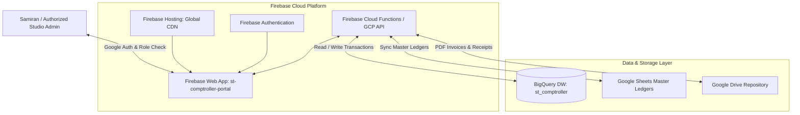

# Implementation Plan: Firebase Web Dashboard (Replacing Looker Studio)

## Overview & Background

The financial workflow currently relies on **Google Looker Studio** for analytics and reporting. However, Looker Studio has major operational limitations:
1. **Read-Only Limitation**: Looker Studio cannot execute bi-directional data writes, manual invoice edits, approval status changes, or operational triggers (e.g. dispatching reminder emails).
2. **Disconnected Editing**: Team members have to switch between Google Sheets and Looker Studio to inspect and edit financial entries.

We are replacing **Google Looker Studio** with a modern, cloud-native **Firebase-Hosted Web Application (`st-comptroller-portal`)**.

---

## Proposed Architecture

---

## Strategic Advantages of Firebase Web Dashboard over Looker Studio

| Requirement / Feature | Looker Studio (Legacy) | Firebase Web Dashboard (Proposed) |
| :--- | :--- | :--- |
| **Analytics & Data Visualization** | Read-only static charts | Interactive dynamic charts (Recharts / Chart.js) |
| **Data Editing** | ❌ Not Possible (Read-Only) | ✅ **Full Bi-directional Edit Capability** (Edit amounts, terms, notes, statuses) |
| **Action Triggers** | ❌ Not Possible | ✅ **One-Click Actions** (Send reminders, approve expenses, convert estimates) |
| **Authentication & Access Control** | Basic Google sharing | Firebase Authentication with strict RBAC (Admin, Line Producer) |
| **Cloud Hosting Platform** | GCP Managed SaaS | **Firebase Hosting** (Native GCP infrastructure, 100% cloud-native) |

---

## Targeted Changes Across Documentation & System Specs

### Documentation & Specifications

#### 1. [cineloom-comtroller-workflow.md](file:///Users/samiransonowal/Documents/GitHub/IN-gen-reimagined_v1/documentation/master-specs/cineloom-comtroller-workflow.md)
- Replace all references to Looker Studio with the **Firebase Comptroller Portal (`st-comptroller-portal`)**.
- Update workflow diagrams and capability matrix to emphasize bi-directional editing and real-time dashboarding on Firebase.

#### 2. [01_core_architecture.md](file:///Users/samiransonowal/Documents/GitHub/IN-gen-reimagined_v1/documentation/tech-stack/01_core_architecture.md)
- Update component diagram to show Firebase Web App / Firebase Hosting as the primary analytics & interactive editing doorway.

#### 3. [cross_architecture_3tier_mandate.md](file:///Users/samiransonowal/Documents/GitHub/IN-gen-reimagined_v1/documentation/organization/cross_architecture_3tier_mandate.md)
- Update technology stack definition to list **Firebase Hosting & Firebase Web App** in place of Looker Studio.

#### 4. [AGENTS.md](file:///Users/samiransonowal/Documents/GitHub/IN-gen-reimagined_v1/AGENTS.md)
- Update Standardized Technology Stack section to list **Firebase Hosting & Firebase Auth / Cloud Functions** for BI, editing & UI.

#### 5. [credentials.env.example](file:///Users/samiransonowal/Documents/GitHub/IN-gen-reimagined_v1/credentials/public/credentials.env.example)
- Replace `LOOKER_EXECUTIVE_DASHBOARD_URL` and `LOOKER_CHASE_LIST_DASHBOARD_URL` with `FIREBASE_PORTAL_URL` and `FIREBASE_PROJECT_ID`.

---

## Verification Plan

### Automated & Manual Verification
- Validate markdown links and document hierarchy across all modified files.
- Verify `AGENTS.md` and `.agents/rules/cloud_native_mandate.md` rules remain strictly enforced with 100% GCP/Firebase cloud-native compliance.
